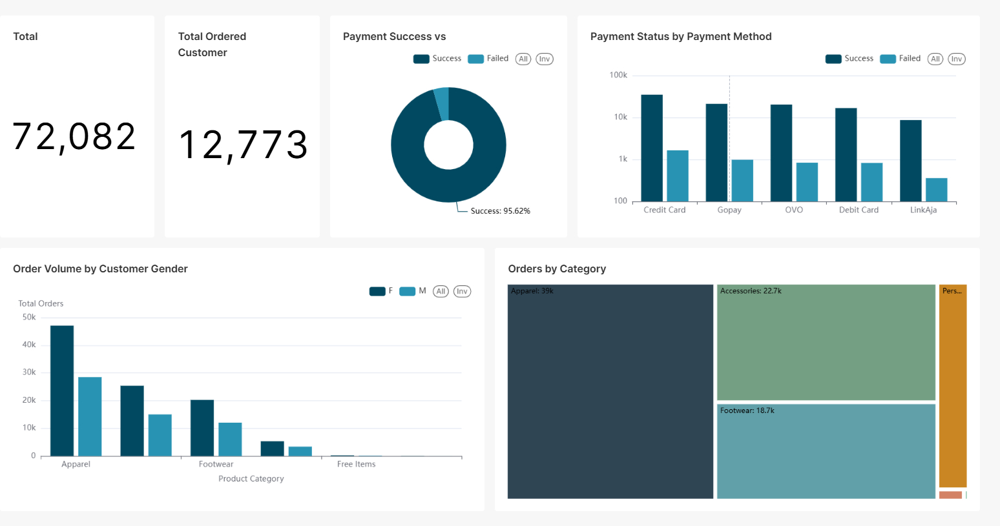

# Realtime ClickStream Analytics System

## 📚 Table of Contents
- [About](#-about)
- [Key Features](#-key-features)
- [Tech Stack](#-tech-stack)
- [Architecture](#️-architecture)
- [Insights](#-insights)
- [How to run this project?](#-how-to-run-this-project)
  - [Cloning Sources](#cloning-sources)
  - [Build Instructions](#build-instructions)
  - [Install Superset](#install-superset)
- [References](#-references)

## 💡 About
This project implements a real-time Clickstream Data Analytics System that leverages modern data engineering tools to build an end-to-end streaming pipeline. It is designed to capture raw clickstream events (such as page views, add to cart clicks, and booking) from a website or application, process them in real-time, store them efficiently, and provide instant insights through dashboards.

## 🎯 Key Features
- Scalable and fault-tolerant architecture.

- Real-time processing with micro-batching (e.g. 1000 records per batch).

- Prevent data loss or duplication by using idempotence in Kafka producer, using checkpoint in Spark Structured Streaming, add column batch_id in ClickHouse to check if batch_id was not processed completely in the past

- Efficient storage with ClickHouse for fast analytical queries. Improving query time by using Primary Key Index properly

- Interactive, auto-refreshing dashboards built with Superset.

## 👨‍💻 Tech Stack
- Apache Kafka (2 Brokers):\
Used as the core message broker to stream clickstream data in real-time. The system includes two Kafka brokers for fault tolerance and scalability.

- Apache Spark (1 Master, 2 Workers):\
Spark Structured Streaming is used to process Kafka messages in micro-batches and transform the data before loading into ClickHouse. Spark runs in a distributed mode with one master node and two workers.

- ClickHouse:\
A high-performance, column-oriented OLAP database optimized for analytical queries. It stores transformed clickstream data and supports fast aggregation, filtering, and exploration.

- Apache Superset:\
A modern data exploration and visualization platform. Superset connects to ClickHouse via SQLAlchemy and provides interactive dashboards with auto-refresh capabilities to visualize user behavior metrics in near real-time.

- Docker:\
All services are containerized and orchestrated with Docker Compose for simplified setup, reproducibility, and local development.

## 🏛️ Architecture


## 📊 Insights





## 🚀 How to run this project?
### Cloning Sources
To obtain the source codes, use the following command:
```bash
git clone https://github.com/Nguyen-Minh-Thinh/realtime_clickstream_analytics_system.git
```
### Build Instructions
1. Rename the `.env.example` file to `.env`, and replace the placeholder values with your respective variables.

2. Navigate to the `realtime_clickstream_analytics_system` folder and create a virtual environment for this project using the following commands:
```bash
python -m venv venv
venv\Scripts\activate
pip install requirements.txt
```

3. To run the docker-compose.yml file, navigate to the `realtime_clickstream_analytics_system` folder and use the following command:
```bash
docker compose -f docker-compose.yml up --build
```

4. After the containers are up and running, access the ClickHouse container to create the database and table using the following command:
```bash
docker exec -it <container_id or container_name> clickhouse-client
```
&nbsp;&nbsp;&nbsp;&nbsp;&nbsp;&nbsp; Inside the ClickHouse client, run:

```sql
CREATE DATABASE <your_clickhouse_database>;

USE <your_clickhouse_database>;

CREATE TABLE <your_clickhouse_table></your_clickhouse_table>
(
    `session_id` String,
    `event_id` String,
    `event_name` String,
    `event_time` DateTime,
    `traffic_source` Nullable(String),
    `search_keywords` Nullable(String),
    `booking_id` Nullable(String),
    `customer_id` Nullable(String),
    `gender` Nullable(String),
    `birthdate` Nullable(Date32),
    `item_price` Nullable(Float32),
    `payment_method` Nullable(String),
    `payment_status` Nullable(String),
    `product_id` Nullable(Int32),
    `quantity` Nullable(Int32),
    `masterCategory` Nullable(String),
    `subCategory` Nullable(String),
    `batch_id` Int32  
)
ENGINE = MergeTree
ORDER BY (event_name, event_time);
```
5. Produce data to Kafka (make sure to stand at `realtime_clickstream_analytics_system` folder and activate virtual environment with installed packages) by running `produce_to_kafka.py` file:
```bash
python produce_to_kafka.py
```

6. Access Spark master container to submit job by using the following command:
```bash
docker exec -it <container_id or container_name> bash

spark-submit --master spark://spark-master:7077 --deploy-mode client --jars /jars/clickhouse-jdbc-0.6.5.jar,/jars/commons-pool2-2.11.1.jar,/jars/kafka-clients-3.5.0.jar,/jars/spark-sql-kafka-0-10_2.12-3.5.0.jar,/jars/spark-token-provider-kafka-0-10_2.12-3.5.0.jar /job/spark_app.py
```
### Install Superset
1. Get Superset via [Superset Quickstart](https://superset.apache.org/docs/quickstart/)

2. Install ClickHouse Connect (ClickHouse Connect requires Python 3.8 or higher):
```bash
pip install clickhouse-connect
```
3. Connect to ClickHouse:
```bash
clickhousedb://{username}:{password}@{host}:{port}
```

 
## 📖 References
- [What is ClickStream data](https://www.fullstory.com/blog/what-is-clickstream-data/)
- [Apache Kafka Documentation](https://kafka.apache.org/documentation/)
- [ClickHouse Documentation](https://clickhouse.com/docs)
- [Creating Your First Dashboard](https://superset.apache.org/docs/using-superset/creating-your-first-dashboard/)
- [Kafka Idempotent Producer](https://medium.com/apache-kafka-from-zero-to-hero/apache-kafka-guide-29-idempotent-producer-84c7e3e5e3b9)
- [Apache Spark Documentation](https://spark.apache.org/docs/latest/streaming/index.html)

- [Superset Quickstart](https://superset.apache.org/docs/quickstart/)

